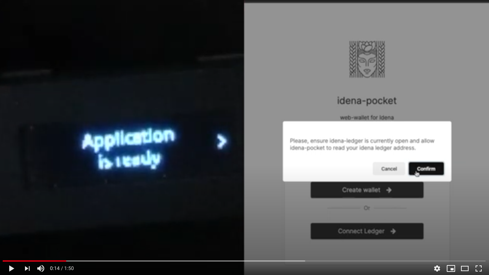

# idena-ledger
Idena wallet application framework for Nano S and Nano X

## How to install (Ledger Nano S)
This app is still not available in [Ledger Live](https://www.ledger.com/ledger-live/), so you will have to install 
it manually as explained in this section. Also a [video tutorial](https://youtu.be/PhUvMrQSi0A) is available.

### Requirements
- python3
- [virtualenv](https://virtualenv.pypa.io/en/latest/)

### 1. Download pre-compiled binaries
```
curl -L https://github.com/idena-dev/idena-ledger/releases/download/v.0.1/idena-ledger-v.0.1.tar.gz | tar xz && cd idena-ledger-v.0.1
```

### 2. Install python environment
```
virtualenv .envs/ledger -p python3
source .envs/ledger/bin/activate
pip install -r requirements.txt
```

If you don't want to use virualenv, you can install ledgerblue as a global dependency:
```
pip3 install ledgerblue
```

### 3. Install the app
```
chmod +x zxtool.sh
./zxtool.sh load
```

## How to use
This video shows how to use idena-ledger app with idena-pocket. Now it works only on Google Chrome with the "Experimental Web Platform features" flag enabled (chrome://flags/#enable-experimental-web-platform-features)
<br />
<a target="_blank" href="https://www.youtube.com/watch?v=-D4lk_cwnRA"></a>

## Supported clients
- [idena-pocket](http://pocket.idena.dev/)

## Links
- [Documentation](https://www.idena.dev/idena-ledger)
- [Telegram](https://t.me/idenadev)

---
Consider supporting idena-ledger by donating to `0x62449c9b1029db6df55ecf215d0aaa0cea23c66d`
